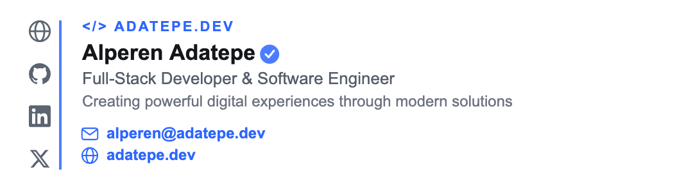
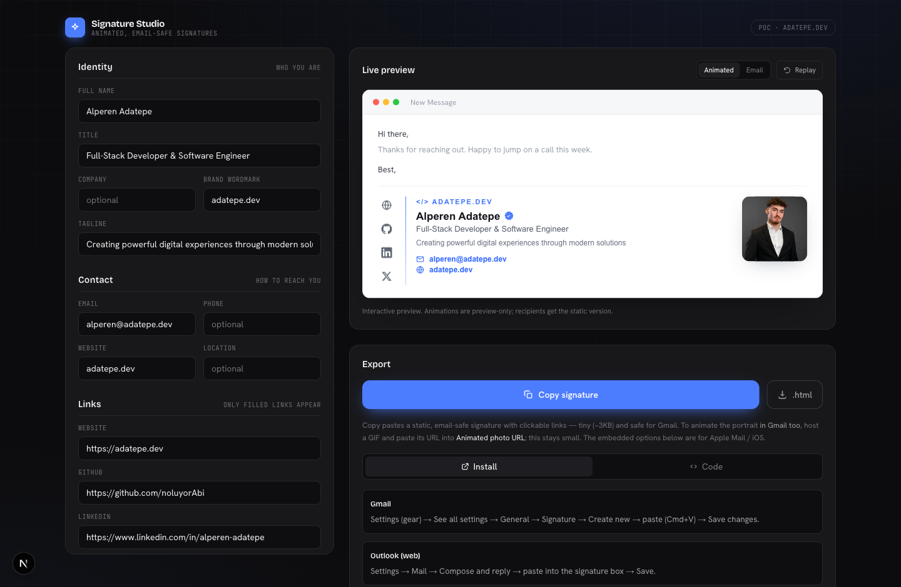

<div align="center">

<h1>Signature Studio</h1>

<p><strong>Animated, email-safe email signatures.</strong><br/>
A live, no-backend builder: edit on the left, watch a real-time preview, export a clean signature tailored to your mail client.</p>

<p>
  
  
  
  
  
  
</p>

<br/>



</div>

<br/>

## What it is

Signature Studio recreates the look of an animated, interactive email signature and exports a
**clean, deliverability-first** version that survives real inboxes. It is a single-page app with
no backend: state lives in `localStorage`, images are referenced by URL, and every export is
generated client-side.

<div align="center">
  
</div>

## Features

<table>
  <tr>
    <td width="50%"><strong>Live editor + preview</strong><br/>Every field updates an instant, animated preview. Sensible defaults; nothing blank.</td>
    <td width="50%"><strong>Email-safe export</strong><br/>Table-based, fully inline-styled, web-safe fonts, Outlook (MSO) safe. Around 3&nbsp;KB.</td>
  </tr>
  <tr>
    <td><strong>Animated portrait</strong><br/>A diagonal strip-reveal, drawn on canvas and encoded as a GIF (<code>gifenc</code>).</td>
    <td><strong>Clickable card</strong><br/>Card layout where every region (icons, links, email, website) is a real <code>&lt;a&gt;</code>.</td>
  </tr>
  <tr>
    <td><strong>Whole-signature GIF</strong><br/>The complete signature as one animated image, rendered entirely on canvas.</td>
    <td><strong>Contrast engine</strong><br/>One accent splits into fill + auto-darkened link text (&ge;&nbsp;4.5:1 on white) with a live warning.</td>
  </tr>
  <tr>
    <td><strong>WYSIWYG truth</strong><br/>An Animated / Email toggle renders the exact serializer output, so preview can never drift from export.</td>
    <td><strong>SSRF-hardened proxy</strong><br/>Cross-origin photos are proxied with private-IP blocking and redirect re-validation.</td>
  </tr>
</table>

## Animation in email

Email only animates via GIF, and clients differ. Signature Studio is honest about this and gives
you the right export per client:

<table>
  <tr><th align="left">Client</th><th align="left">Behaviour</th></tr>
  <tr><td><strong>Apple Mail / iOS</strong></td><td>Embedded GIF + icons animate, links stay clickable. No hosting needed.</td></tr>
  <tr><td><strong>Gmail</strong></td><td>Signature field caps at ~10&nbsp;KB, so host the GIF and paste its URL. The static signature stays tiny and safe.</td></tr>
  <tr><td><strong>Outlook desktop</strong></td><td>Shows the first frame, a clean static signature.</td></tr>
</table>

## Promo

Advertisement videos are built programmatically with [Remotion](https://remotion.dev) in
[`ads/`](ads) and rendered straight from the same design system.

<div align="center">
  
  <br/>
  <sub>
    <a href="ads/out/signature-studio-promo.mp4">Promo (1920x1080)</a> &middot;
    <a href="ads/out/signature-studio-square.mp4">Square (1080x1080)</a>
  </sub>
</div>

```bash
cd ads && bun install
bun run studio          # open the Remotion editor
bun run render:promo    # render the 1080p promo
```

## Tech

`Next.js 16` (App Router) &middot; `React 19` &middot; `TypeScript` &middot; `Tailwind CSS v4` &middot; `Bun` &middot; `gifenc` &middot; `Remotion` &middot; HTML Canvas

## Getting started

```bash
bun install
bun run dev          # http://localhost:3000
```

```bash
bun run build        # production build
bun run gen          # write a static signature .html
bun run gen:animated # write a signature with an embedded animated portrait
```

## How it works

- **One source, two render paths.** A single `SignatureData` object feeds an animated React
  preview and a pure `buildSignatureHtml(data)` serializer. They share data, never CSS, so the
  email output is deterministic.
- **Two-tier styling.** A dark, tech-forward app chrome wraps a light "paper" signature card
  (Arial, off-black text) that never inherits the chrome tokens, because dark signatures invert
  badly under email dark mode.
- **Canvas, not screenshots.** The portrait and the whole-signature GIF are drawn directly on a
  `<canvas>` and encoded with `gifenc`, then animated by compositing a static base with the
  per-frame strip reveal.
- **Accent as a contrast-safe token.** `lib/accent.ts` derives `accentFill` (divider, badge) and
  an auto-darkened `accentText` (links) so a bright brand colour never fails AA on white.

<details>
<summary><strong>Project structure</strong></summary>

```
app/
  layout.tsx                 fonts + metadata
  globals.css                dark theme tokens, easing, keyframes
  page.tsx                   two-pane shell + faux email window
  api/proxy-image/route.ts   SSRF-hardened image proxy
components/
  Editor.tsx                 grouped form (identity, contact, links, appearance)
  SignatureCard.tsx          animated live preview
  SocialNav.tsx              vertical social icon nav
  ProfilePhoto.tsx           strip-reveal portrait / monogram fallback
  ExportPanel.tsx            copy / download / GIF / clickable card
  icons.tsx                  inline SVG glyphs
lib/
  types.ts                   SignatureData model
  defaults.ts                pre-fill (adatepe.dev brand)
  accent.ts                  contrast-safe accent engine
  signatureTokens.ts         shared light signature palette + font
  exportHtml.ts              email-safe HTML serializer
  portraitGif.ts             canvas portrait GIF
  fullSignatureGif.ts        whole-signature GIF
  cardSignature.ts           clickable card (embedded icons + links)
  iconCanvas.ts              shared canvas icon drawing
  usePersistentSignature.ts  localStorage-backed state
ads/                         Remotion advertisement videos
  src/Promo.tsx              1080p landscape ad
  src/Square.tsx             square social ad
  src/SignatureCardVideo.tsx animated signature, rebuilt for video
```

</details>

## License

MIT &copy; [noluyorAbi](https://github.com/noluyorAbi)
